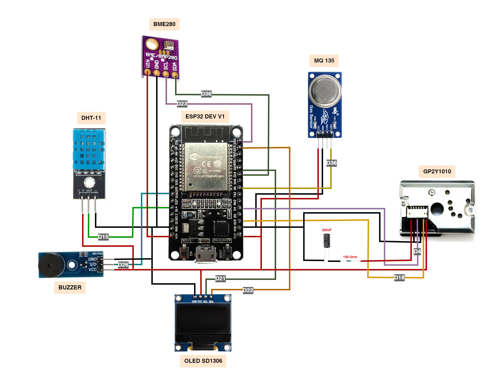
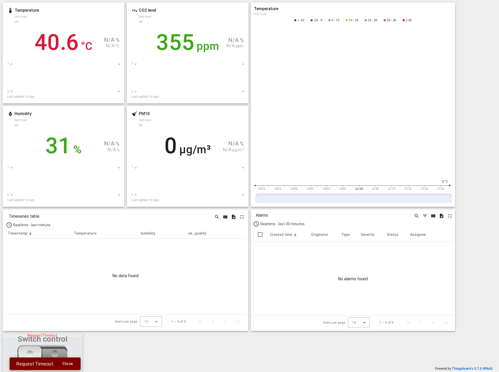

# Indoor Air Quality Monitoring System

## Introduction

This project aims to design and implement an Indoor Air Quality Monitoring System using an ESP32 microcontroller. The system continuously monitors the environment for critical air quality parameters, such as temperature, humidity, and gas concentration. These parameters help in understanding and controlling indoor air conditions, ensuring a healthy living environment. The data is collected through multiple sensors and sent to a cloud-based platform for visualization and analysis.

# Sensors Used

1. MQ-135 Gas Sensor: Used to detect harmful gases, including CO2, NH3, alcohol, and benzene, providing an air quality index.
2. DHT11 Temperature and Humidity Sensor: Measures ambient temperature and humidity levels.
3. GP2Y1010 Dust Sensor: Monitors particulate matter (PM) concentrations, providing data on dust density.
4. Buzzer: Provides an audible alert when the air quality deteriorates or exceeds specified limits (e.g., when the temperature exceeds 37°C).
5. LED Indicators: Signals different levels of air quality.

  

# Cloud

  

# Results

The system successfully measured and transmitted real-time air quality data to a cloud platform (ThingsBoard or ThingSpeak), where it was visualized through dashboards. Alerts were triggered based on preset thresholds for gas concentrations and temperature, enabling quick response.

# Some key results:

- Temperature and Humidity: Regular monitoring showed stable indoor conditions, with occasional spikes that triggered the buzzer.
- Air Quality: Detected moderate to high levels of pollutants during specific activities like cooking or the use of household chemicals, which affected the overall indoor air index.

# Conclusion

This project successfully demonstrates the use of ESP32 and a range of sensors to monitor indoor air quality. The system provides real-time data to users, allowing them to take corrective action to maintain a healthy environment. In the future, this project can be expanded to include additional parameters or integration with home automation systems for better control.
